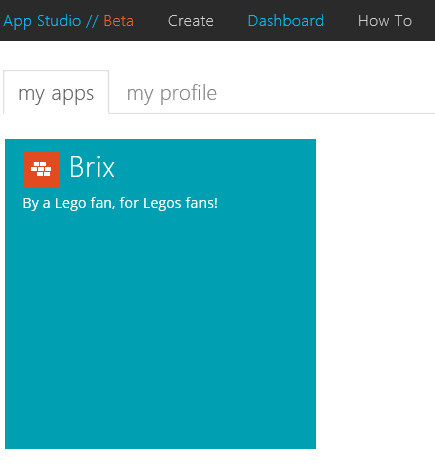
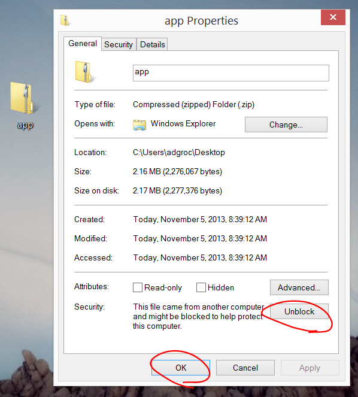
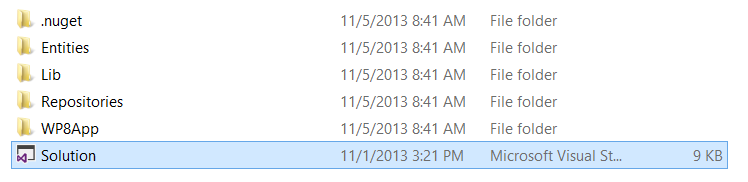
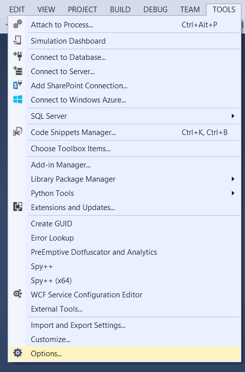
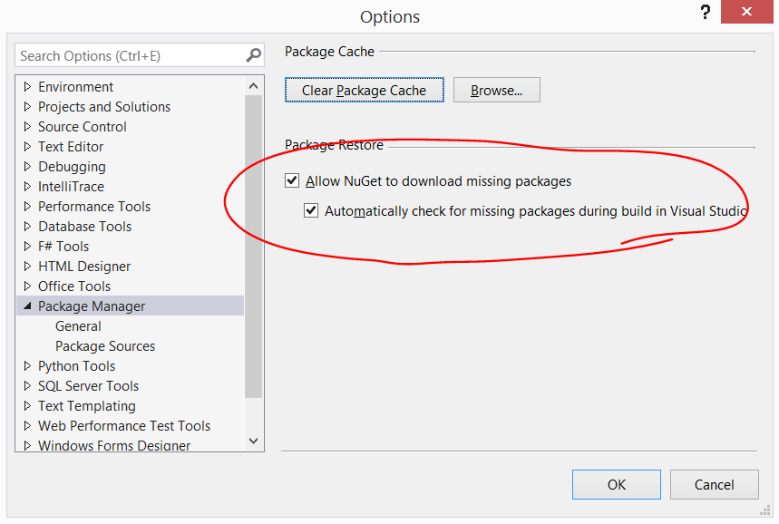
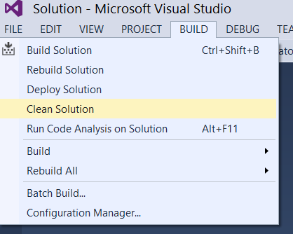
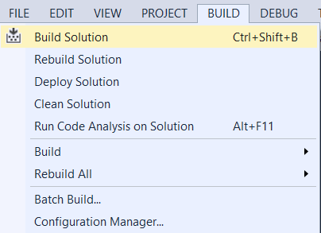
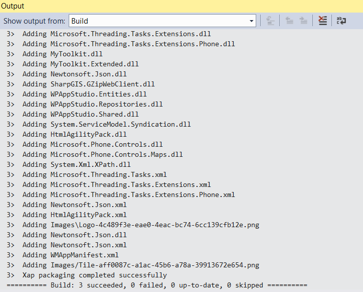

# Building the Source Code for your AppStudio App #

---

## Overview ##

This hands on lab will walk you through the process of downloading and building the source code for your AppStudio app.

### Prerequisities ###

The following is required to complete this hands-on lab:
- An app built with AppStudio. If you haven't built an app with app studio, you can follow [this step-by-step hands on lab](https://github.com/agrocholski/windows-phone-app-studio-hol/blob/master/build-your-first-app/hol.md) to do so.
- Visual Studio 2012 or Visual Studio 2013 with the Windows Phone SDK installed.

---

## Exercise ##

1. Open Internet Explorer and sign in to [AppStudio](http://apps.windowsstore.com). Go to your **Dashboard** and select the app you want to download the source code for.

	

	_Dashboard_

1. Click the **Download Source Code** link.

	

	_Download Source Code_

1. Read the guidance provided for publishing your app, then click **Download**.

	

	_Download_

1. Right-click on the downloaded zip file and select **Properties**. In the properties dialog that displays click **Unblock**, then click **OK**.

	

	_Unblock_

1. Extract the zip file, navigate to the **src** folder and open the **Solution** file using Visual Studio.

	

	_Solution_

1. In Visual Studio, go to the **TOOLS** menu and select **Options**.

	

	_Options_

1. In the **Options** dialog, find **Package Manager** and make sure the following options are checked:
	- **Allow NuGet to download missing packages**
	- **Automatically check for missing packages during build in Visual Studio**

	

	_Package Manager_

1. Clean the solution by using the **BUILD** menu.

	

	_Clean_

1. Build the soultion by either pressing **Ctrl+Shift+B** or by using the **BUILD** menu.

	

	_Build_

1. The solution should now build successfully.

	

	_Success_