
# Adding Ads to your AppStudio App #

---

## Overview ##

This hands on lab will walk you through the process of adding ads to your AppStudio app.

### Prerequisities ###

The following is required to complete this hands-on lab:
- An app built with AppStudio. If you haven't built an app with app studio, you can follow [this step-by-step hands on lab](https://github.com/agrocholski/windows-phone-app-studio-hol/blob/master/01-build-your-first-app/hol.md) to do so.
- The source code for your AppStudio app. If you haven't downloaded and built the srouce code for your app, you can follow [this step-by-step hands on lab](https://github.com/agrocholski/windows-phone-app-studio-hol/blob/master/02-build-the-source-code-for-your-app/hol.md) to do so.
- Visual Studio 2012 or Visual Studio 2013 with the Windows Phone SDK installed.

---

## Exercises ##

This hands-on lab includes the following exercises:
- [Exercise 1: Registering with pubCenter](#Exercise1)
- [Exercise 2: Add the Windows Phone ad control to your App](#Exercise2)

### Exercise 1: Registering with pubCenter ###

In this exercise you will learn how to
- [Sign up for a pubCenter account](#Ex1Task1)
- [Register a mobile application with pubCenter](#Ex1Task2)
- [Create a mobile application ad unit with pubCenter](#Ex1Task3)

##### Task 1: Sign up for a pubCenter account ####

In this task you will learn how to sign up for a pubCenter account.

1. Open Internet Explorer and navigate to [http://pubcenter.microsoft.com/](http://pubcenter.microsoft.com/).

1. Click the **Sign up now** button

	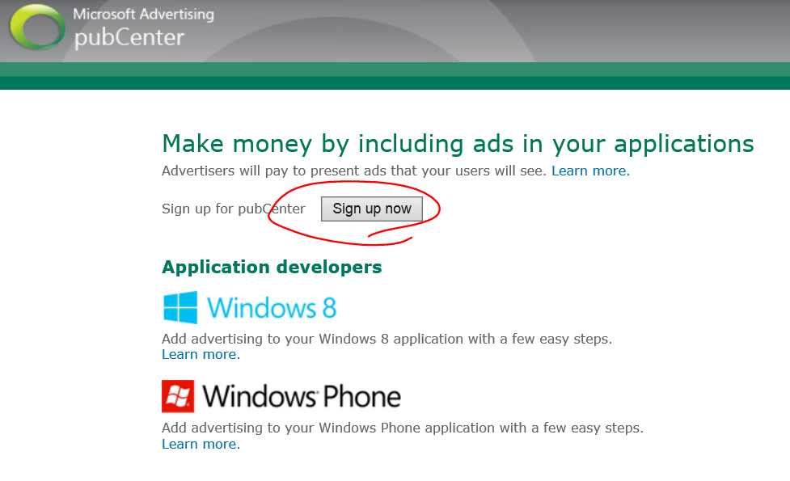

	_Sign up now_

1. If prompted, **Sign in** with your Microsoft account.

	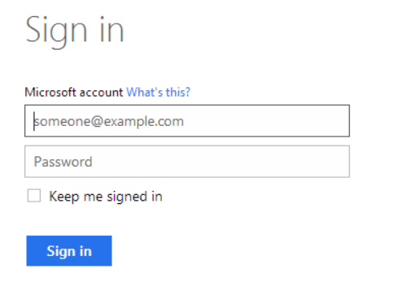

	_Sign in_

1. Confirm or change the information displayed, check the checkbox, and click **Continue**

	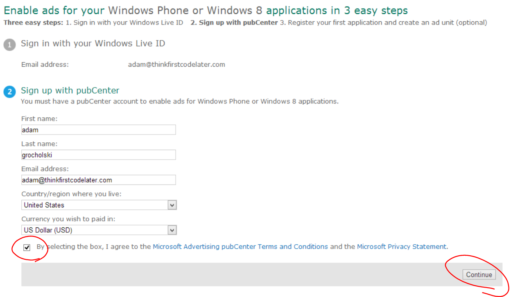

	_Contact information_

That's it! You're registered with pubCenter. Proceed to [Task 2](#Ex1Task2) to register your mobile application with pubCenter.

##### Task 2: Register a mobile application with pubCenter ####

In this task you will learn how to register a mobile application with pubCenter.

1. Open Internet Explorer and navigate to [http://pubcenter.microsoft.com/](http://pubcenter.microsoft.com/).

1. Click the **Sign in with your Microsoft account** link.

	

	_Sign in with your Microsoft account_

1. Enter the credentials associated with your Microsoft account and click the **Sign in** button.

	

	_Sign in_

1. Click the **Setup** link at the top of the page

	

	_Setup_

1. Click the **Register application** link

	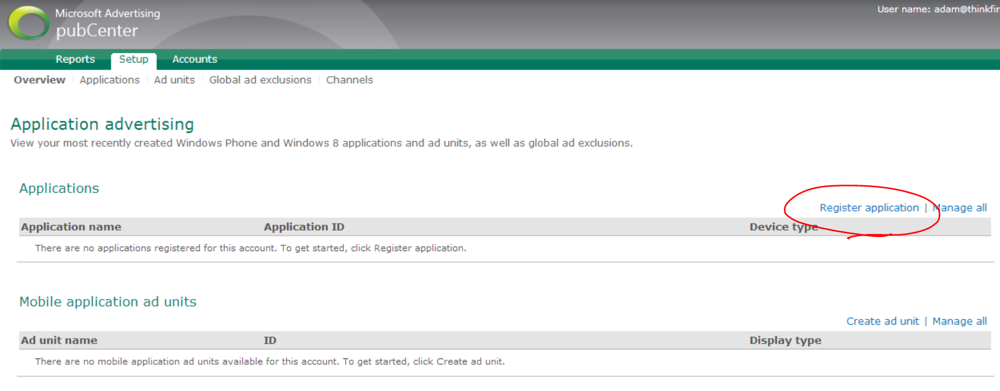

	_Register application_

1. Enter the **Name** of your application, select **Windows Phone** for the **Device type**, and click the **Save** button.

	

	_Application information_

1. Once your application is registered, copy the **Application Id**, as you will need it for [Exercise 2](#Exercise2).

	

	_Application details_

##### Task 3: Create a mobile application ad unit with pubCenter ####

In this task you will learn how to create a mobile application ad unit with pubCenter.

1. Open Internet Explorer and navigate to [http://pubcenter.microsoft.com/](http://pubcenter.microsoft.com/).

1. Click the **Sign in with your Microsoft account** link.

	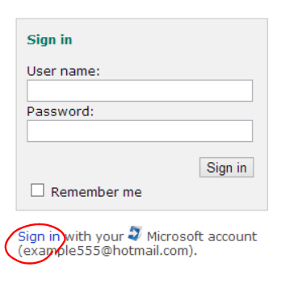

	_Sign in with your Microsoft account_

1. Enter the credentials associated with your Microsoft account and click the **Sign in** button.

	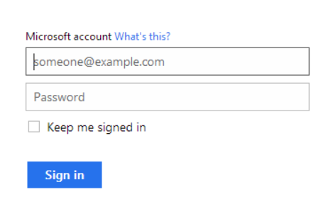

	_Sign in_

1. Click the **Setup** link at the top of the page

	

	_Setup_

1. Click the **Create ad unit** link.

	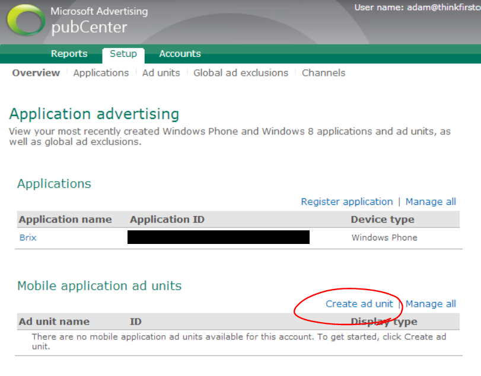

	_Create ad unit_

1. Enter the **Ad unit name**, select your **Application**, and select the **Ad unit size**.

	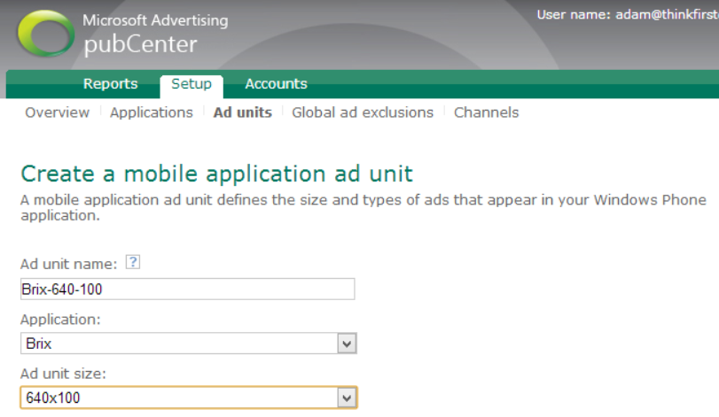

	_Ad unit details_

1. Select the appropriate **Dev Center app category** and **Dev Center app subcategory** (if applicable), then click the **Save** button.

	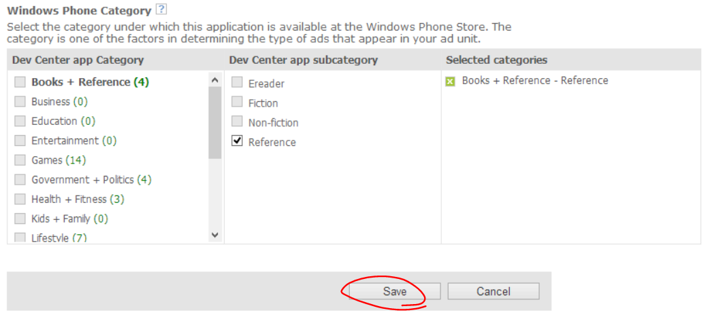

	_Dev Center app category_

1. Once the ad unit is created, copy the **Ad Unit Id**, as you will need it for [Exercise 2](#Exercise2).

	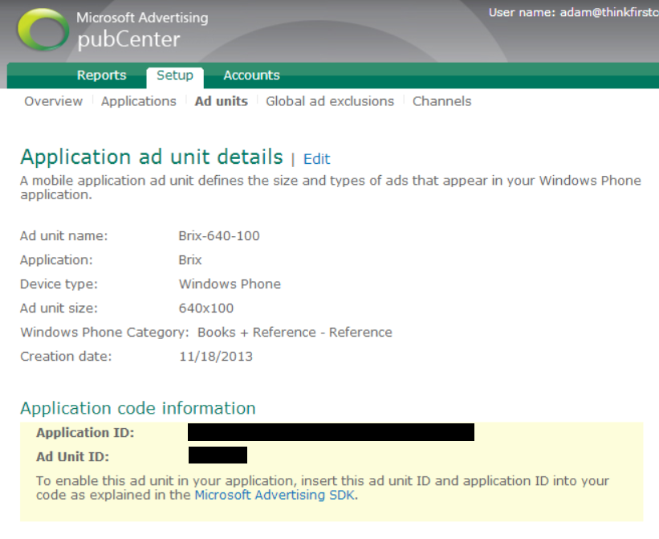

	_Ad unit details_

### Exercise 2: Add the Windows Phone ad control to your App ###

In this exercise you will learn how to add the Windows Phone advertising control to your app to display ads.

If you have not already downloaded and built the source code for your AppStudio app, please follow this step-by-step guide before proceeding: [https://github.com/agrocholski/windows-phone-app-studio-hol/blob/master/02-build-the-source-code-for-your-app/hol.md](https://github.com/agrocholski/windows-phone-app-studio-hol/blob/master/02-build-the-source-code-for-your-app/hol.md).

1. Open the **Solution** file for your source code.

	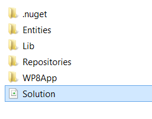

	_Solution_

1. Using **Solution Explorer**, open the **1 - UI** folder, expand the **WP8App** project, expand the **View** folder, and double-click the **.xaml** file that corresponds to the menu you create in AppStudio.

	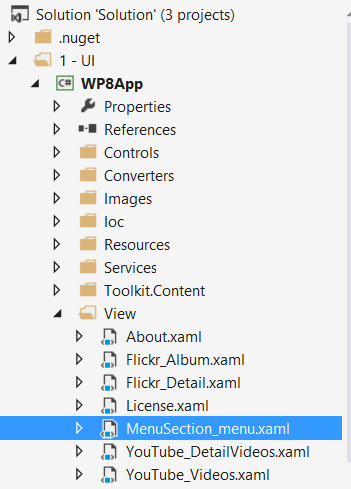

	_Menu_

1. If the file opens in the visual designer, click the **XAML** button to view the markup of the page.

	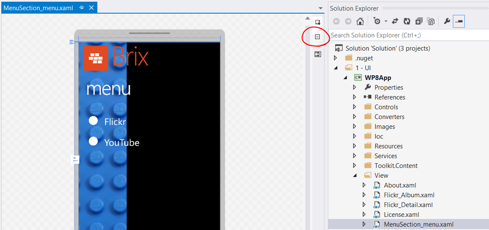

	_Designer_

1. Press **Ctrl + G**, enter **65**, and press the **OK** button.

	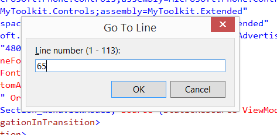

	_Go To Line_

1. Remove the **comment tags** that surround lines 67-70.

	

	_Remove comment tags_

1. Update the **Height** and **Width** attributes of the **AdControl** to match the dimensions of the ad unit you created in [Exercise 1, Task 3](#Ex1Task3).

	

	_Ad unit dimensions_

1. Update the **AdUnitId** attribute of the **AdControl** to the value for the ad unit you created in [Exercise 1, Task 3](#Ex1Task3).

	

	_Ad unit id_

1. Update the **ApplicationId** attribute of the **AdControl** to the value for the mobile application you registered in [Exercise 1, Task 2](#Ex1Task2)

	

	_Application id_

**Note:** You can run your app using the emulator by pressing the **Emulator WVGA 512MB** button in the toolbar. However, live ads will not display in the emulator. In order to view live ads, you need to deploy the app to a Windows Phone.

That's it! You've successfully added ads to your AppStudio app. You can now package it up and submit it to the store.