
# Windows Phone App Studio Hands On Lab #

---

## Overview ##

This hands on lab will walk you through the process of building, testing, and publishing your first app using Microsoft's Windows Phone App Studio.

### Objectives ###

In this hands-on lab, you will learn how to:

- Sign up for Windows Phone App Studio
- Create your first app
- Customize your app
- Generate and test your app
- Publish your app

### Prerequisities ###

The following is required to complete this hands-on lab:
- A Microsoft account - [sign up for a free Microsoft account](https://signup.live.com)
- Optional: a Windows Phone to test your app

---

## Exercises ##

This hands-on lab includes the following exercises:
- [Exercise 1: Signing up for Windows Phone App Studio](#Exercise1)
- [Exercise 2: Creating your first app](#Exercise2)
- [Exercise 3: Adding content to your app](#Exercise3)
- [Exercise 4: Styling your app](#Exercise4)
- [Exercise 5: Generating and testing your app](#Exercise5)
- [Exercise 6: Publishing your app](#Exercise6)

### Exercise 1: Signing up for Windows Phone App Studio ###

In this exercies you will sign up for access to Windows Phone App Studio. If you already have access to App Studio, please proceed to [Exercise 2](#Exercise2).

1. Open Internet Explorer and go to [http://http://apps.windowsstore.com/](http://http://apps.windowsstore.com/n).

1. Click the **Start Building** button.

	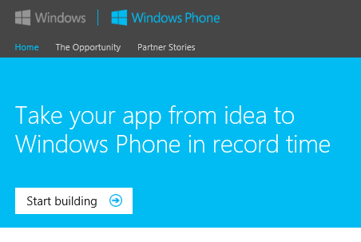

	_Start Building_

1. Sign in with your Microsoft account

	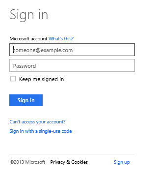

	_Sign In_

1. Click **Yes** to allow App Studio to access your email addresses in your profile.

	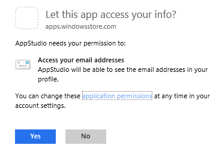

	_Access_

1. Agree to the terms and click **Register**.

	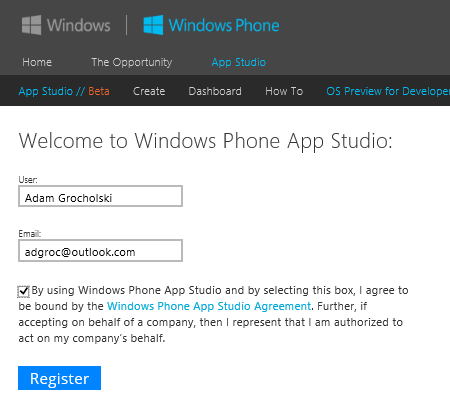

	_Register_

1. The next page you see will be your App Studio dashboard, which means you're good to go!

	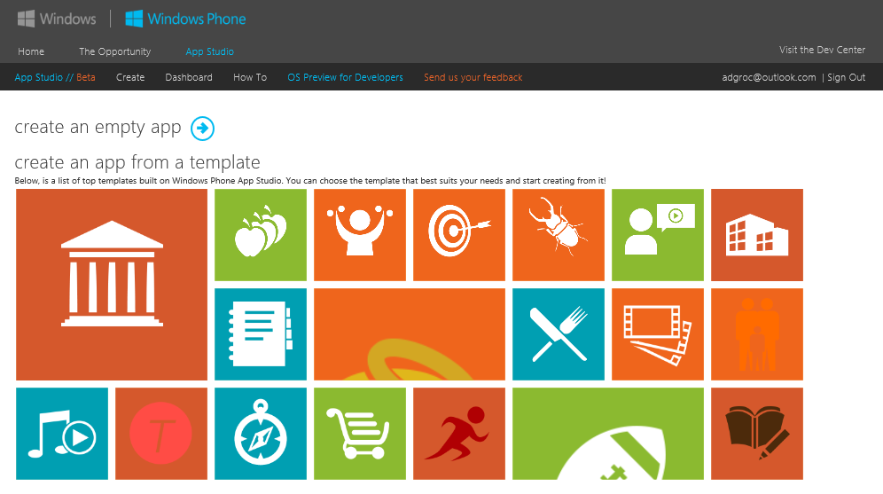

	_Dashboard_

### Exercise 2: Creating your first app ###

In this exercise you will create your first app using App Studio.

1. If not already open, open Internet Explorer and browse to your [App Studio dashboard](http://apps.windowsstore.com/DashBoard/Index).

1. Click the **Create App** button

	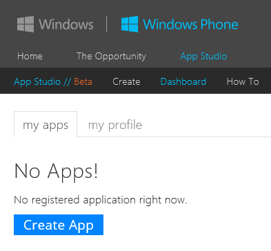

	_Create App_

1. As you can see, there are a number of templates available for you to use in App Studio. For your first app, we'll actually start with an empty app. Click **create an empty app**.

	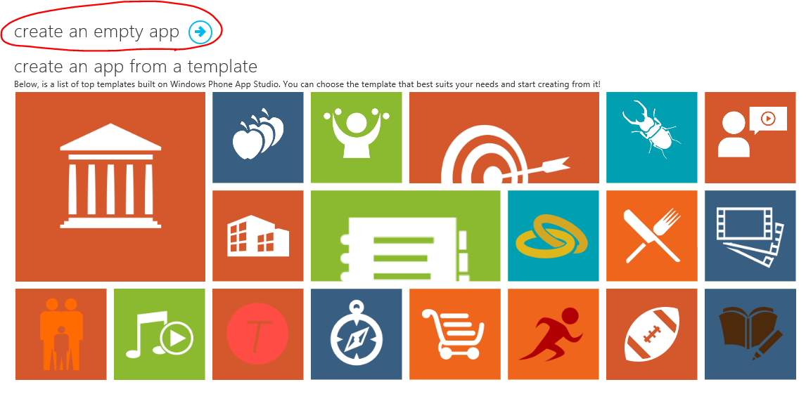

	_Empty App_

1. Specify a **TITLE**, **DESCRIPTION**, and **DEFAULT LANGUAGE** for your app.

1. To change your app's logo click the **LOGO** image

	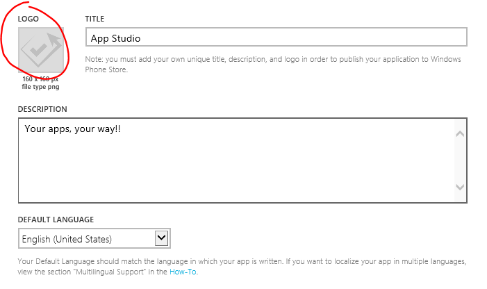

	_Logo_

1. Select a 160x160 image from your computer, your SkyDrive account or from the App Studio resources.

	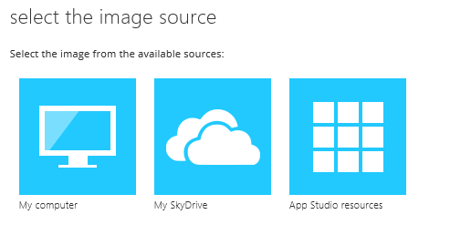

	_Image Source_

1. Once your title, description, default language, and logo have been specified your ready to move on to the next task.

	

	_Done_

### Exercise 3: Adding content to your app ###

In this exercise you will add content to your app from Flickr and YouTube.

##### Task 1: Adding a menu to your app ####

In this task you will learn how to add a menu to your app

1. From the **App Information** page click **Next** or **Configure App Content**

	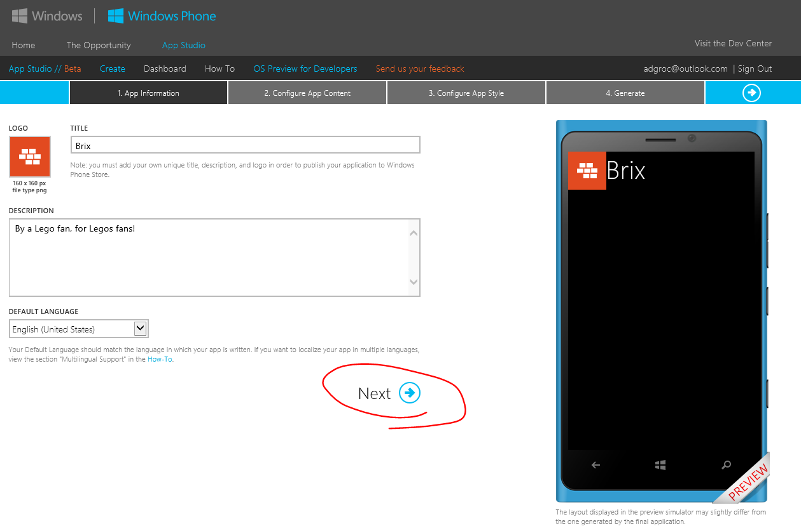

	_Next_

1. Click the **+** button to add a **Section** to your app.

	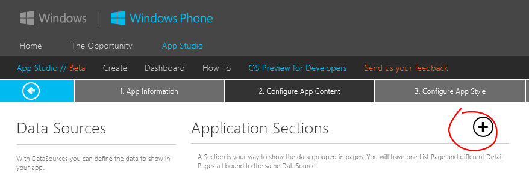

	_Add Application Section_

1. Click the **Add Menu** link to add a menu section to your app.

	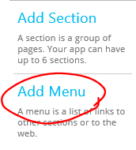

	_Add Menu_

1. Change the **MENU TITLE**.

	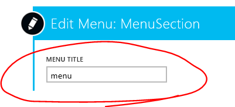

	_Menu Title_

#### Task 2: Adding Flickr content to your app ####

In this task you will learn how to add content from Flickr to your app.

1. Click the **+** button next to **Menu Items**, then click the **Add Section Item** link.

	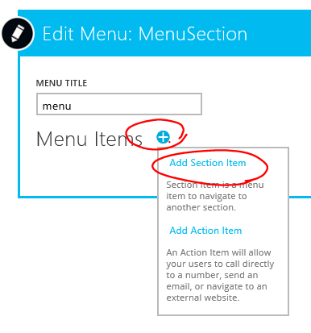

	_Add Section Item_

1. Enter a **SECTION NAME**, select the **Flickr** datasource, enter a **DATASOURCE NAME**, and click **Save Changes**.

	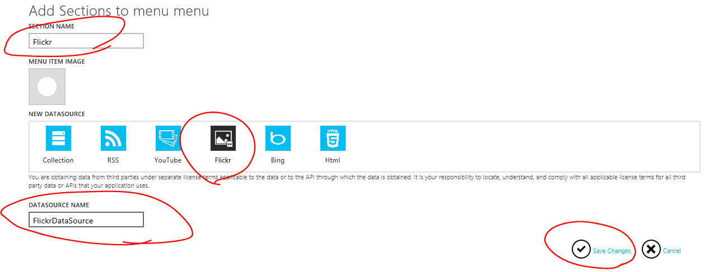

	_Flickr Section_

1. Click the **pencil** to edit the Flickr section.

	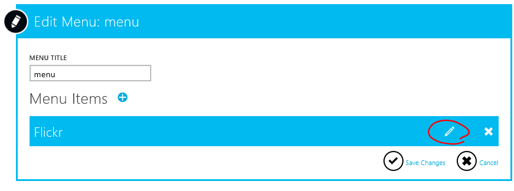

	_Edit Flickr Section_

1. To change the Flickr search used by your app, click the **Flickr Data Source** button.

	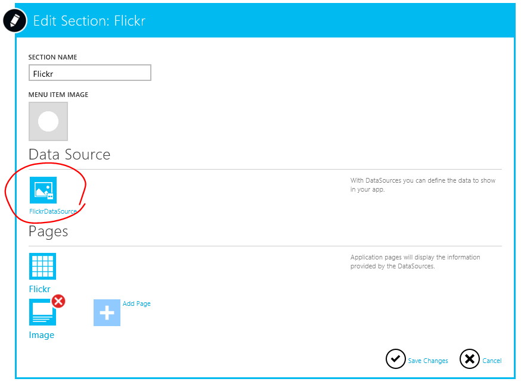

	_Edit Data Sorce_

1. Change the default search phrase and click **Refresh**. If you're happy with the results, click the **checkmark** to save your changes.

	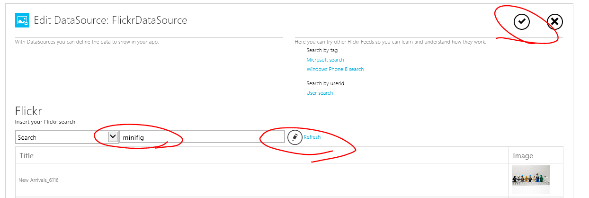

	_Data Source_

#### Task 3: Adding YouTube content to your app ####

In this task you'll learn how to add content from YouTube to your app.

1. Click the **pencil** next to the menu section to edit it.

	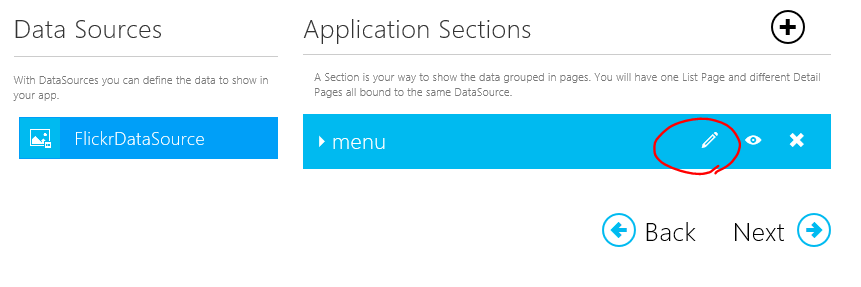

	_Edit Menu_

1. Click the **+** button next to **Menu Item**, then click the **Add Section Item** link.

	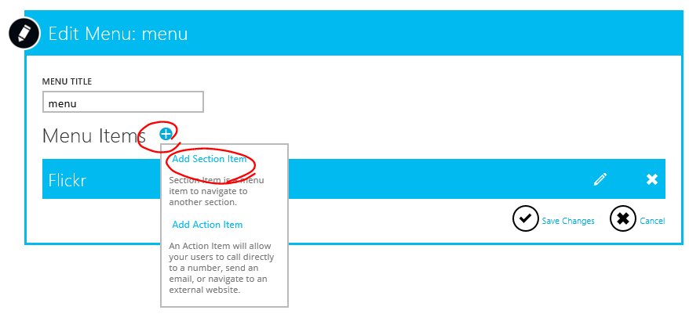

	_Add Section Item_

1. Enter a **SECTION NAME**, select the **YouTube** datasource, enter a **DATASOURCE NAME**, and click **Save Changes**.

	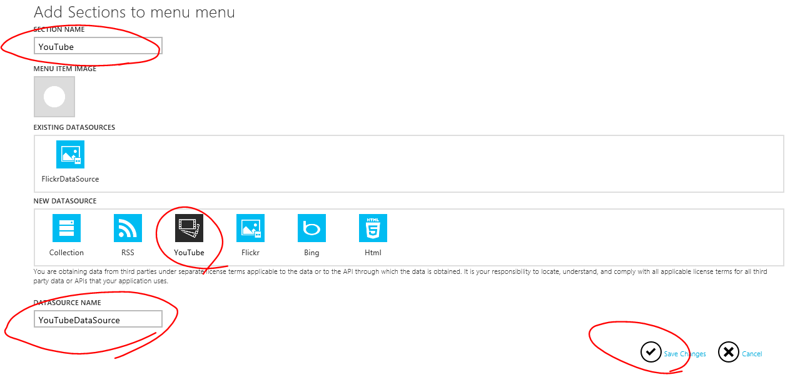

	_YouTube Section_

1. Clikc the **pencil** to edit the YouTube section.

	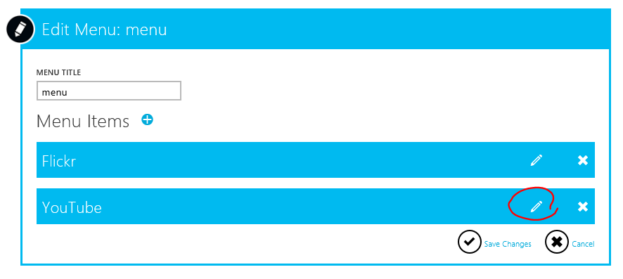

	_Edit YouTube Section_

1. To change the YouTube search used by your app, click the **YouTube Data Source** button.

	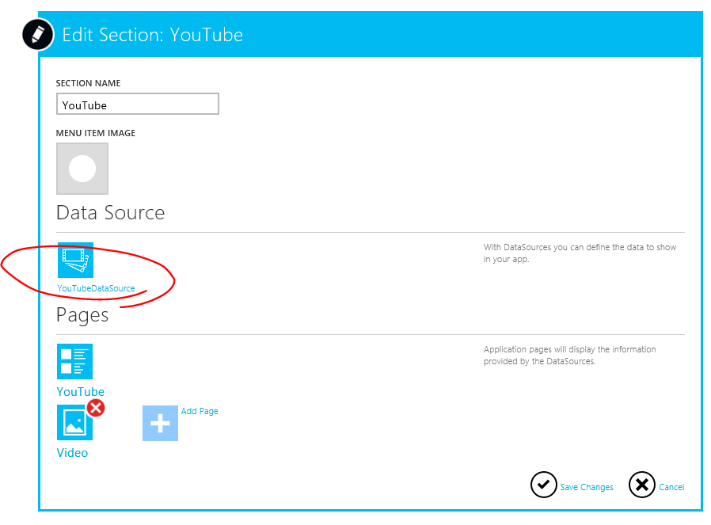

	_Edit Data Sorce_

1. Change the default search phrase and click **Refresh**. If you're happy with the results, click the **checkmark** to save your changes.

	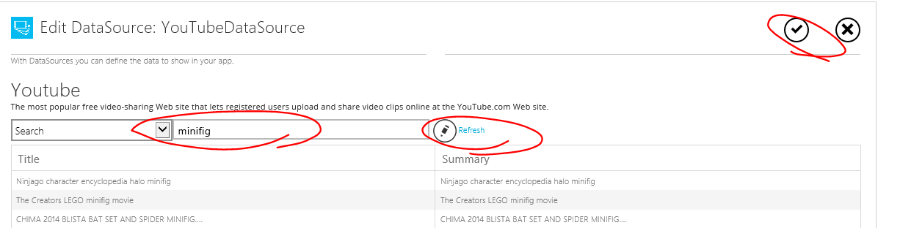

	_Data Source_

### Exercise 4: Configuring your app's style ###

In this exercise you will learn how to configure the style of your app by doing the following:

- Customizing the colors within your app
- Customizing the tiles used by your app
- Customizing the splash and lock screen used by your app

#### Task 1: Color customization ####

In this task you will learn how to customize the colors within your app.

1. Click the **Next** button on the **Configure App Content** page.

	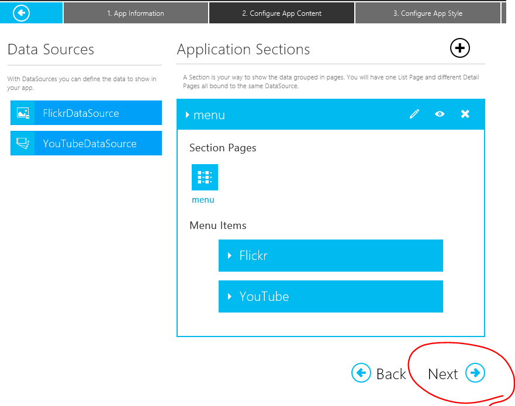

	_Next_

1. Change the **ACCENT BRUSH**. You can either use one of the predfined colors, or enter a custom color.

	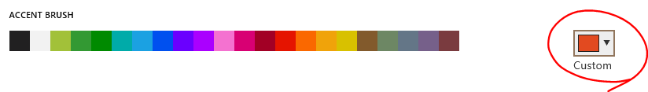

	_Accent Brush_

1. Change the **BACKGROUND BRUSH**. You can either use one of the predefined colors, or use an image.

	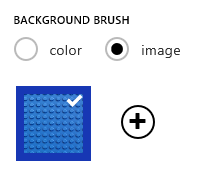

	_Background Brush_

1. Change the **FOREGROUND BRUSH**. You can either use one of the predefined colors, or enter a custom color.

	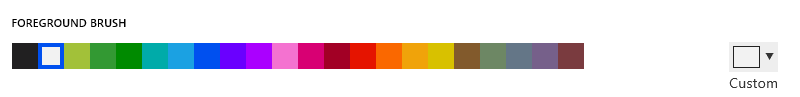

	_Foreground Brush_

1. Change the **APPLICATION BAR BRUSH**. You can either use one of the predefined colors, or enter a custom color.

	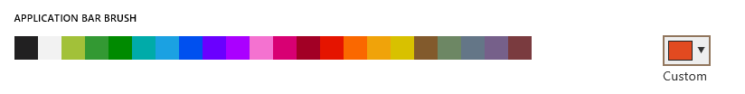

	_Application Bar Brush_

#### Task 2: Tile customization ####

In this task you will learn how to customize the tiles used by your app.

1. On the **Configure App Style** page, click **tiles**.

	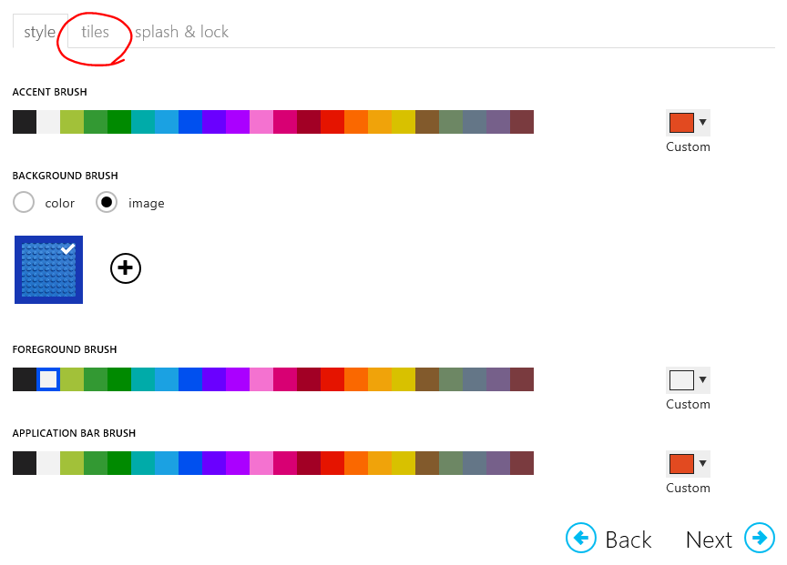

	_Tiles_

1. Select the **Flip template**, then click **Edit**.

	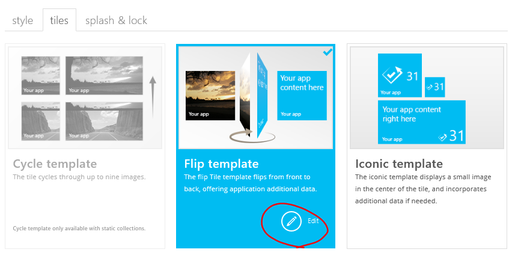

	_Flip Template_

1. Customize the template by specifying a **TITLE**, **SMALL IMAGE**, **NORMAL IMAGE**, **BACK TITLE**, **BACK CONTENT** and a **BACK IMAGE**. When complete press the **checkmark** button.

	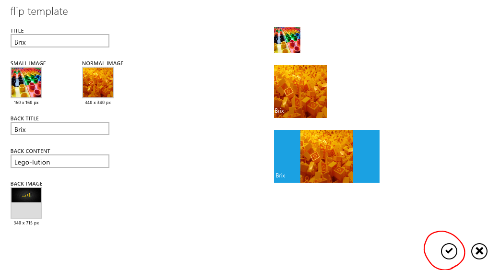

	_Edit Flip Template_

#### Task 3: Splash and lock screens ####

In this task you will learn how to customize your app's splash and lock screens.

1. On the **Configure App Style** pae, click **splash & lock**.

	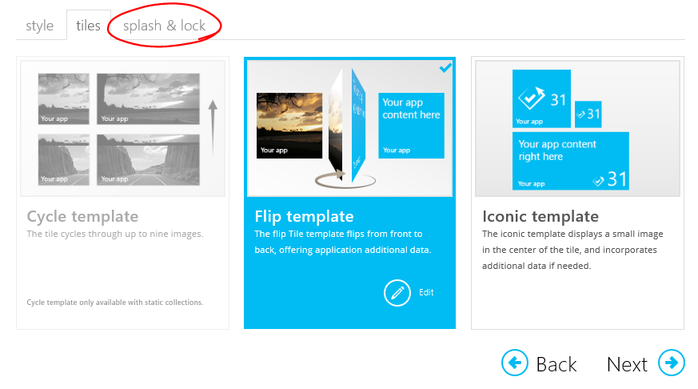

	_Splash & Lock_

1. To choose an image for your app's splash screen, click the **+** button next to the **SPLASH SCREEN BACKGROUND**.

	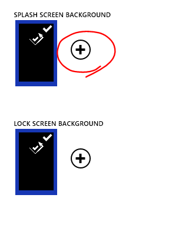

	_Splash Screen_

	The image must be in jpg format and should be 768px by 1280px.

1. To choose an image for your app's lock screen, click the **+** button next to the **LOCK SCREEN BACKGROUND**.

	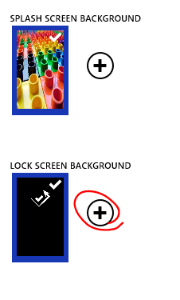

	_Lock Screen_

	The image can be in jpg or png format and should either be 480px by 800px or 960px by 1708px.

### Exercise 5: Generating and testing your app ###

In this exercise you will learn how to generate and test your app.

**Note:** In order to test your app you will need to have access to a Windows Phone device.

1. Click the **Next** button.

	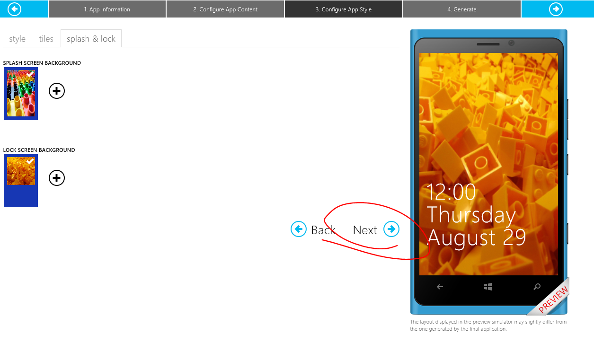

	_Next_

1. Click the **Generate app** link.

	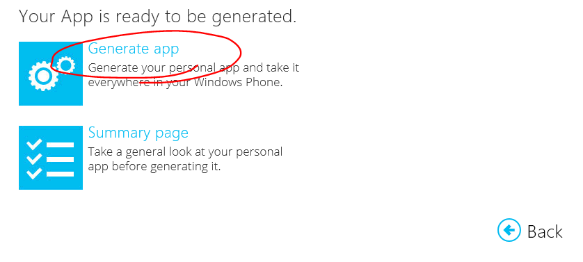

	_Generate App_

1. Confirm the that you want to generate the app by clicking the **checkmark**.

	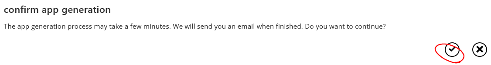

	_Confirm_

1. Wait for your app to be generated. This process could take several minutes

	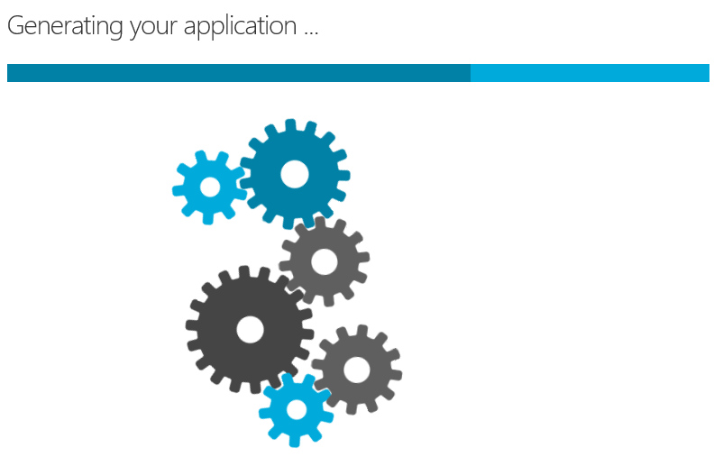

	_Generating App_

1. Once your app is generated, using the Windows Phone you want to test the app on, check your email for confirmation that the app has been generated. This email will contain a link to a certificate you must install on your phone prior to testing the app. Click the **click here** link to install the certificate.

	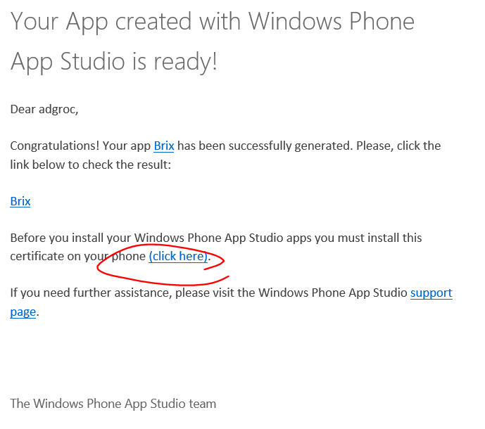

	_Install Certificate_

1. Sign in with your Microsoft account.

	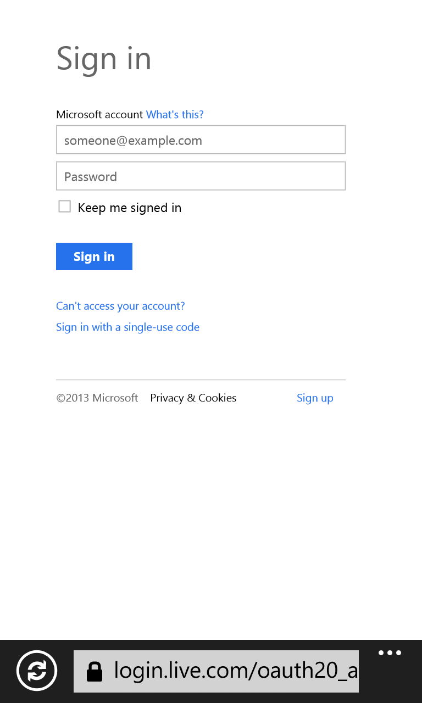

	_Sign In_

1. Install the certificate.

	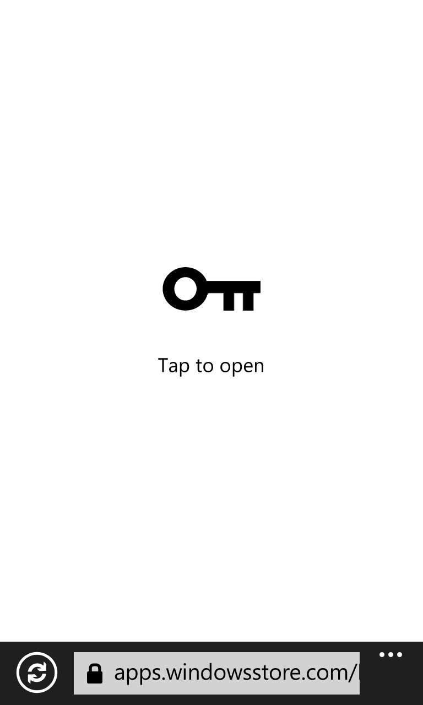

	_Certificate_

1. Using your phone, scan the **QR** code displayed in App Studio.

	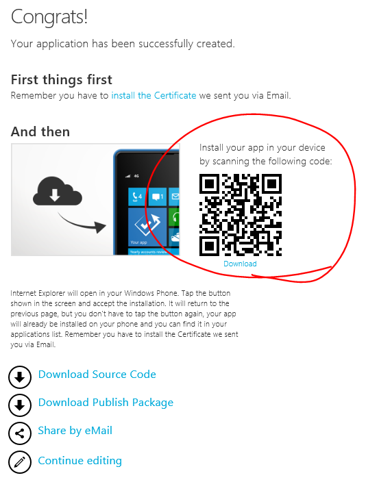

	_Scan Code_

1. Confim you want to install the app by clicking the **install** button.

	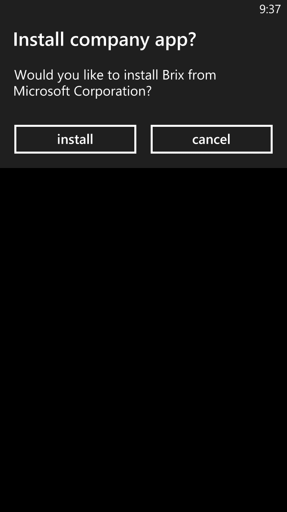

	_Install App_

1. After the install completes your app will appear in the list of apps on your phone. Tap the icon to start testing!

	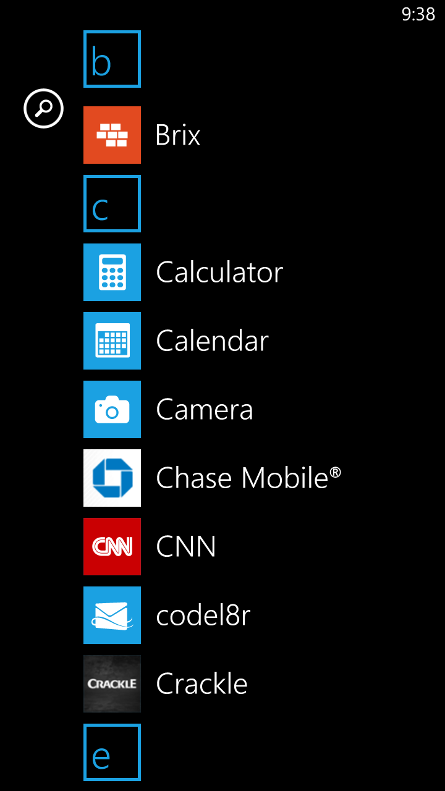

	_Installed!_

### Exercise 6: Publishing your app ###

In this exercise you will learn how to publish your app to the Windows Phone Store.

#### Task 1: Creating a Windows Phone Dev Center account ####

In this task you will learn how to create a Windows Phone Dev Center account.

If you already have an account with the Windows Phone Dev Center, proceed to [Task 2](#Ex4Task2).

1. Open Internet Explorer and go to [https://dev.windowsphone.com/en-us/join](https://dev.windowsphone.com/en-us/join).

1. Click the **Join Now** button

	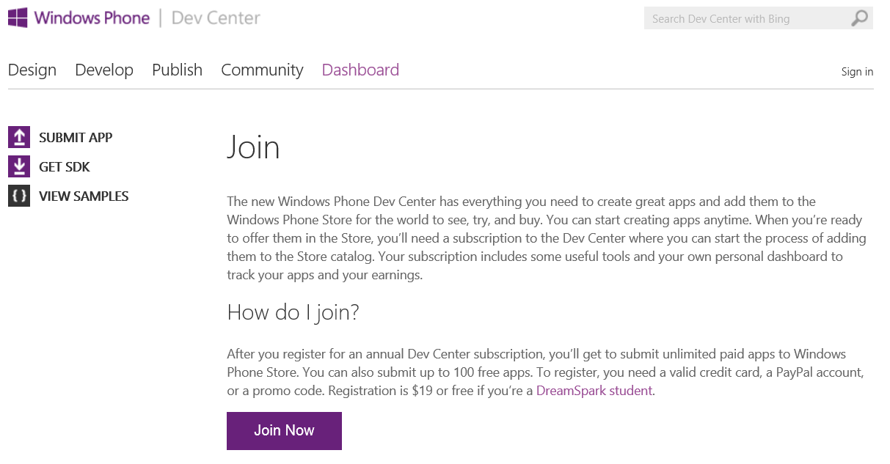

	_Join Now_

1. Sign in with your Microsoft account.

	

	_Sign In_

	**Note:** If you plan on using DreamSpark for a free Dev Center you will need to sign in using the Microsoft account associated with your DreamSpark account.

1.	Get started by selecting your country/region of residence or business, account type, and agreeing to the legal terms. Then click **Next**.

	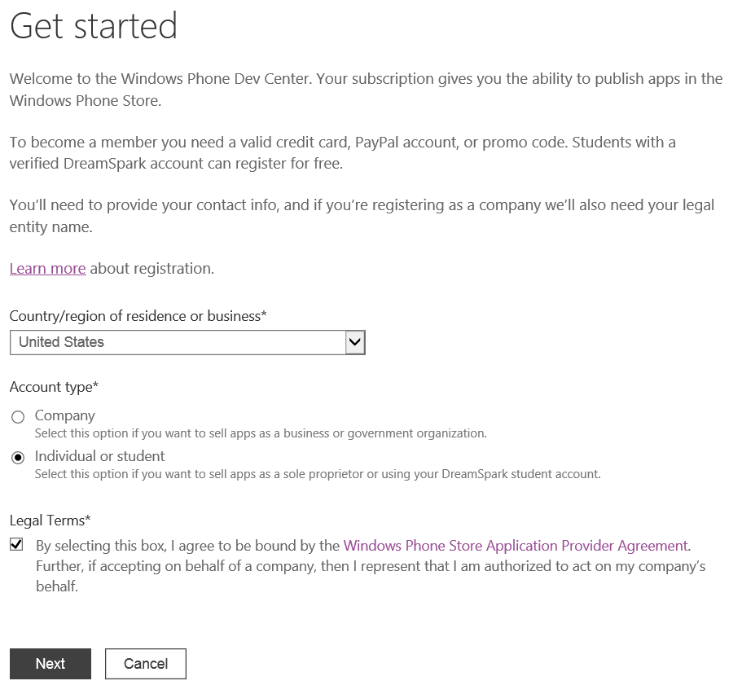

	_Get Started_

	Select a **Company** account if you're registering on behalf of a corporation, LLC, partnership, or other company legally registered with your government.

	Select an **Individual/Student** account if you are an individual developer or a student with a verified DreamSpark account.

1. Fill in your contact information.

	

	_Contact Info_

1. Create a **Publisher Name** and click **Next**. The **Publisher Name** is what users see on their phone. Publisher names are unique and will be verified during the registration and account validation processes.

	

	_Publisher Info_

1. Purchase your subscription by selecting the appropriate payment option and click **Next**. There are three ways you can purchase a subscription:
	- You can pay by credit card or PayPal.
	- If you're a student and have a DreamSpark account, you can set up a free Dev Center account.
	- If you have a prompo code, you can redeem it by entering the code in the field.

	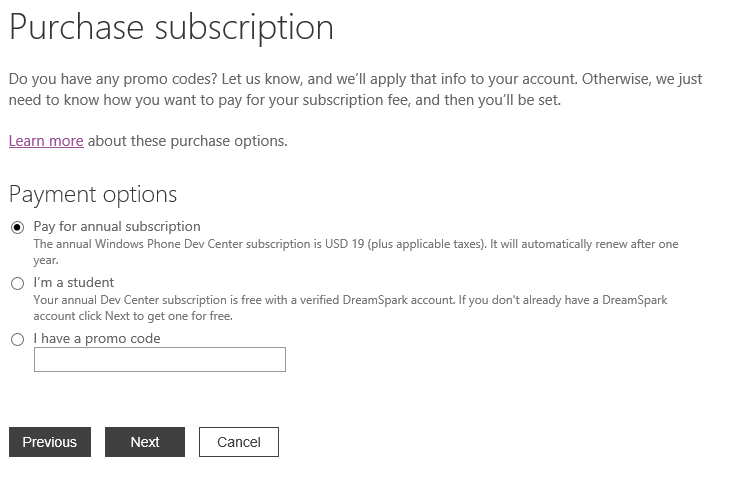

	_Purchase_

#### Task 2: Publishing your app ####

In this task you will learn how to publish your app.

Prior to publishing your package you will need to do the following:

- Create a 300px x 300px tile to represent your app.
- Create 1 768px x 1280px or 1280px x 768px screenshot of your app. This can be done by simply taking a screenshot of the app on your Windows Phone after you installed in [Exercise5](#Excercise5).

1. In App Studio, click the **Download Publish Package** link.

	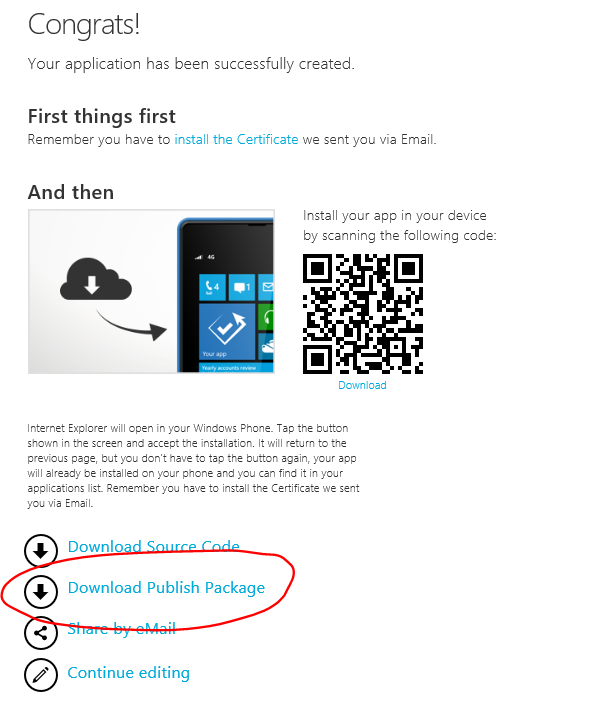

	_Download Package_

1. Be sure to read the guidance provided, then click **Download** to save the package to your machine.

	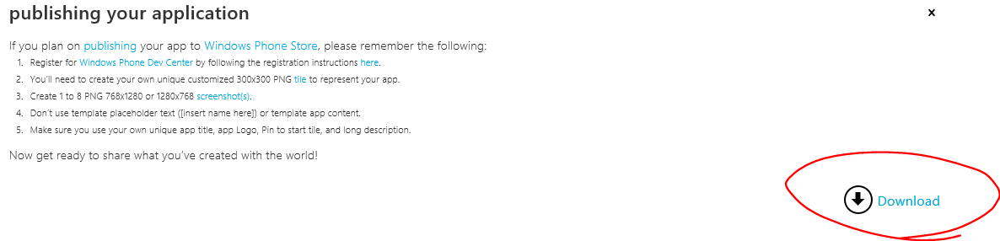

	_Download_

1. If you're not already signed into the Windows Phone Dev Center, open Internet Explorer and navigate to [https://dev.windowsphone.com/en-us](https://dev.windowsphone.com/en-us), and click **Sign in** to sign in with your Microsoft account.

	

	_Sign In_

1. Click the **SUBMIT APP** button.

	

	_Submit App_

1. Click **App info** to start providing information about your app.

	

	_App Info_

1. Enter an **App alias** and select a **Category** for you app.

	

	_App Alias & Category_

1. If you want to charge for your app change the **Base price**, then click **Save**.

	

	_Pricing_

1. Click **Upload and describe your XAP(s)** to upload the package you generated with App Studio.

	

	_Upload & Describe_

1. Click **Add new** and select the package you downloaded from App Studio.

	

	_Add New_

1. Once the package is uploaded, scroll down and enter a **Description for the Store** as well as **Specific keywords**.

	

	_Description & Keywords_

1. Scroll down and click the **+** image to upload a 300px x 300px app title icon.

	

	_App Title Icon_

1. Scroll down and click the **+** to upload a screenshot of your app. Then click **Save**.

	

	_Screenshots & Save_

1. Click **Review and submit**.

	

	_Review and submit_

1. Review the details of your app and click **Submit**

	

	_Submit_

1. That's it! Your app has been submitted. You'll receive an email once it has been published!

	

	_Success_