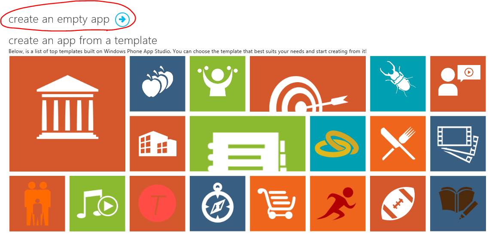
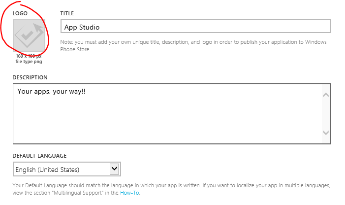
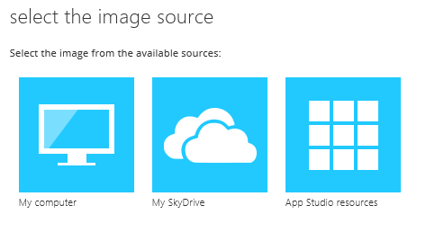
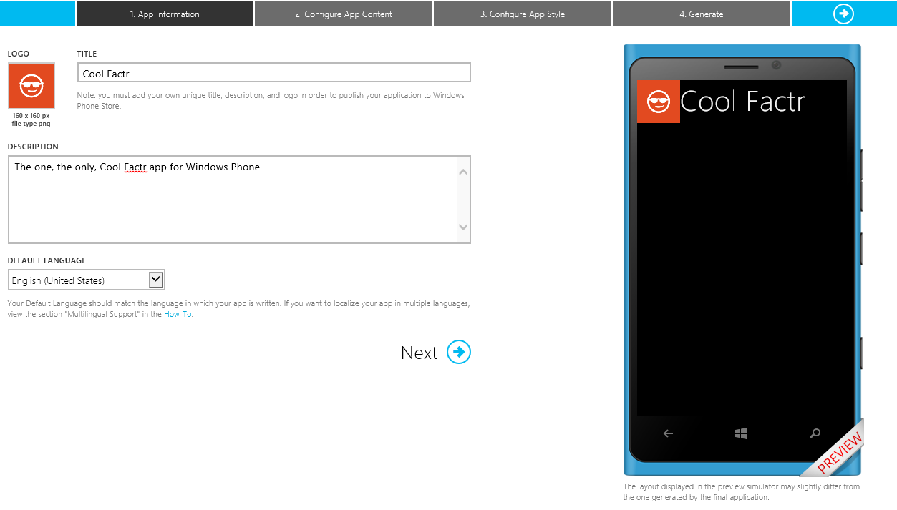
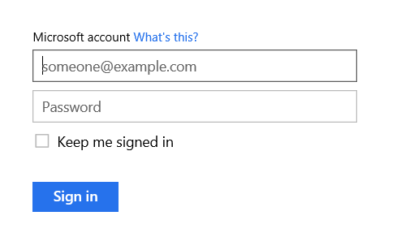
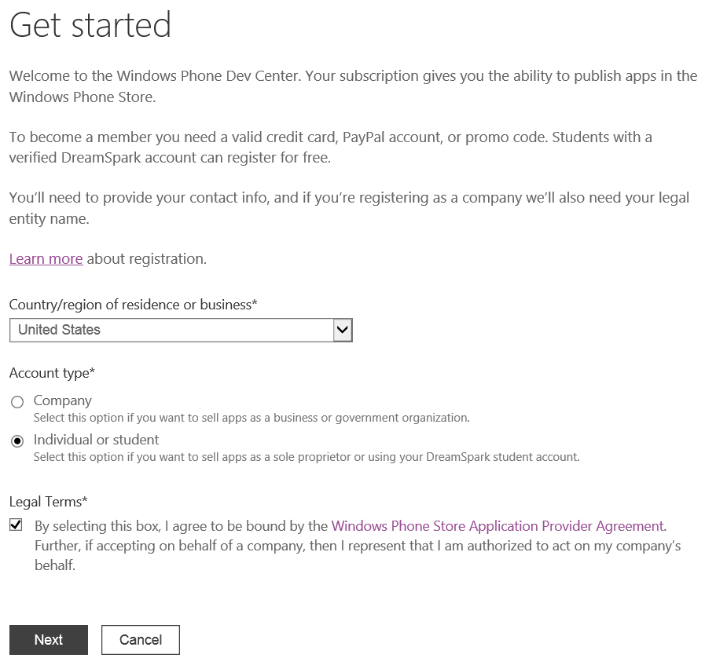
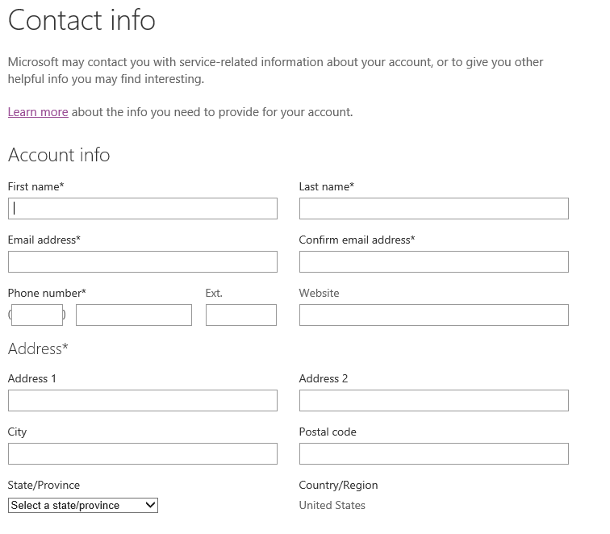
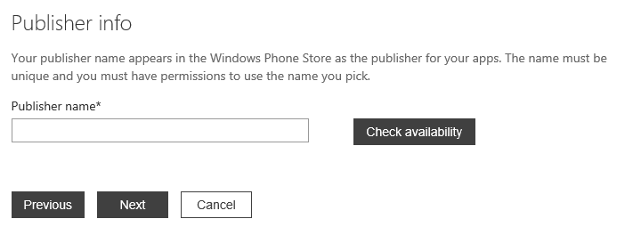

# Windows Phone App Studio #

---

## Overview ##

### Objectives ###

In this hands-on lab, you will learn how to:

- Sign up for Windows Phone App Studio
- Create your first app
- Customize your app
- Test your app
- Publish your app

### Prerequisities ###

The following is required to complete this hands-on lab:
- A Microsoft account - [sign up for a free Microsoft account](https://signup.live.com)
- An account with one of the following
	- [YouTube](http://youtube.com)
	- [Flickr](http://flickr.com)
	- [Tumblr](http://tumblr.com)

---

## Exercises ##

This hands-on lab includes the following exercises:
- [Exercise 1: Signing up for Windows Phone App Studio](#Exercise1)
- [Exercise 2: Creating your first app](#Exercise2)
- [Exercise 3: Testing your app](#Exercise4)
- [Exercise 4: Publishing your app](#Exercise5)

### Exercise 1: Signing up for Windows Phone App Studio ###

1. Open Internet Explorer and go to [http://http://apps.windowsstore.com/](http://http://apps.windowsstore.com/n).

1. Click the **Start Building** button.

	

	_Start Building_

1. Sign in with your Microsoft account

	

	_Sign In_

1. Click **Yes** to allow App Studio to access your email addresses in your profile.

	

	_Access_

1. Agree to the terms and click **Register**.

	

	_Register_

1. The next page you see will be your App Studio dashboard, which means you're good to go!

	

	_Dashboard_

### Exercise 2: Creating your first app ###

In this exercise you will create your first app using App Studio by doing the following:

- Specifying your app's information
- Configuring your app's content
- Configuring your app's style

#### Task 1: Specifying your app's information ####

1. If not already open, open Internet Explorer and browse to your [App Studio dashboard](http://apps.windowsstore.com/DashBoard/Index).

1. Click the **Create App** button

	

	_Create App_

1. As you can see, there are a number of templates available for you to use in App Studio. For your first app, we'll actually start with an empty app. Click **create an empty app**.

	

	_Empty App_

1. Specify a **TITLE**, **DESCRIPTION**, and **DEFAULT LANGUAGE** for your app.

1. To change your app's logo click the **LOGO** image

	

	_Logo_

1. Select a 160x160 image from your computer, your SkyDrive account or from the App Studio resources.

	

	_Image Source_

1. Once your title, description, default language, and logo have been specified your ready to move on to the next task.

	

	_Done_

#### Task 2: Configuring your app's content ####

In this task you will learn how to customize your app using content from YouTube, Flickr, or Tumblr. Complete one of the options below.

##### Option 1: YouTube #####

##### Option 2: Flickr #####

##### Option 3: Tumblr #####

#### Task 3: Configuring your app's style ####

### Exercise 3: Testing your app ###

In this exercise you will learn how to test your app.

### Exercise 4: Publishing your app ###

In this exercise you will learn how to publish your app to the Windows Phone Store.

#### Task 1: Creating a Windows Phone Dev Center account ####

If you already have an account with the Windows Phone Dev Center, proceed to [Task 2](#Ex4Task2).

1. Open Internet Explorer and go to [https://dev.windowsphone.com/en-us/join](https://dev.windowsphone.com/en-us/join).

1. Click the **Join Now** button

	

	_Join Now_

1. Sign in with your Microsoft account.

	

	_Sign In_

	**Note:** If you plan on using DreamSpark for a free Dev Center you will need to sign in using the Microsoft account associated with your DreamSpark account.

1.	Get started by selecting your country/region of residence or business, account type, and agreeing to the legal terms. Then click **Next**.

	

	_Get Started_

	Select a **Company** account if you're registering on behalf of a corporation, LLC, partnership, or other company legally registered with your government.

	Select an **Individual/Student** account if you are an individual developer or a student with a verified DreamSpark account.

1. Fill in your contact information.

	

	_Contact Info_

1. Create a **Publisher Name** and click **Next**. The **Publisher Name** is what users see on their phone. Publisher names are unique and will be verified during the registration and account validation processes.

	

	_Publisher Info_

1. Purchase your subscription by selecting the appropriate payment option and click **Next**. There are three ways you can purchase a subscription:
	- You can pay by credit card or PayPal.
	- If you're a student and have a DreamSpark account, you can set up a free Dev Center account.
	- If you have a prompo code, you can redeem it by entering the code in the field.

	

	_Purchase_

#### Task 2: Publishing your app ####