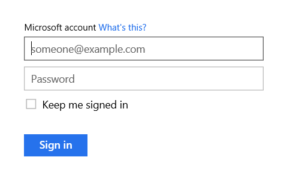

# Windows Phone App Studio #

---

## Overview ##

### Objectives ###

In this hands-on lab, you will learn how to:

- Sign up for Windows Phone App Studio
- Create your first app
- Customize your app
- Test your app
- Publish your app

### Prerequisities ###

The following is required to complete this hands-on lab:
- A Microsoft account - [sign up for a free Microsoft account](https://signup.live.com)
- An account with one of the following
	- [YouTube](http://youtube.com)
	- [Flickr](http://flickr.com)
	- [Tumblr](http://tumblr.com)

---

## Exercises ##

This hands-on lab includes the following exercises:
- [Exercise 1: Signing up for Windows Phone App Studio](#Exercise1)
- [Exercise 2: Creating your first app](#Exercise2)
- [Exercies 3: Customizing your app](#Exercise3)
- [Exercise 4: Testing your app](#Exercise4)
- [Exercise 5: Publishing your app](#Exercise5)

### Exercise 1: Signing up for Windows Phone App Studio ###

### Exercise 2: Creating your first app ###

### Exercise 3: Customizing your app ###

In this exercise you will learn how to customize your app. 

#### Task 1: Using content from the Web ####

In this task you will learn how to customize your app using content from YouTube, Flickr, or Tumblr. 

##### Option 1: YouTube #####

##### Option 2: Flickr #####

##### Option 3: Tumblr #####

### Exercise 4: Testing your app ###

### Exercise 5: Publishing your app ###

In this exercise you will learn how to publish your app to the Windows Phone Store.

#### Task 1: Creating a Windows Phone Store account ####

If you already have an account with the Windows Phone store, proceed to [Task 2](#Ex5Task2).

1. Open Internet Explorer and go to [https://dev.windowsphone.com/en-us/join](https://dev.windowsphone.com/en-us/join).

1. Click the **Join Now** button

	

	_Join Now_

1. Sign in with your Microsoft account.

	

	_Sign In_

1.	Get started by selecting your country/region of residence or business, account type, and agreeing to the legal terms. Then click **Next**.

	

	_Get Started_

	Select a **Company** account if you're registering on behalf of a corporation, LLC, partnership, or other company legally registered with your government.

	Select an **Individual/Student** account if you are an individual developer or a student with a verified DreamSpark account. 

#### Task 2: Publishing your app ####